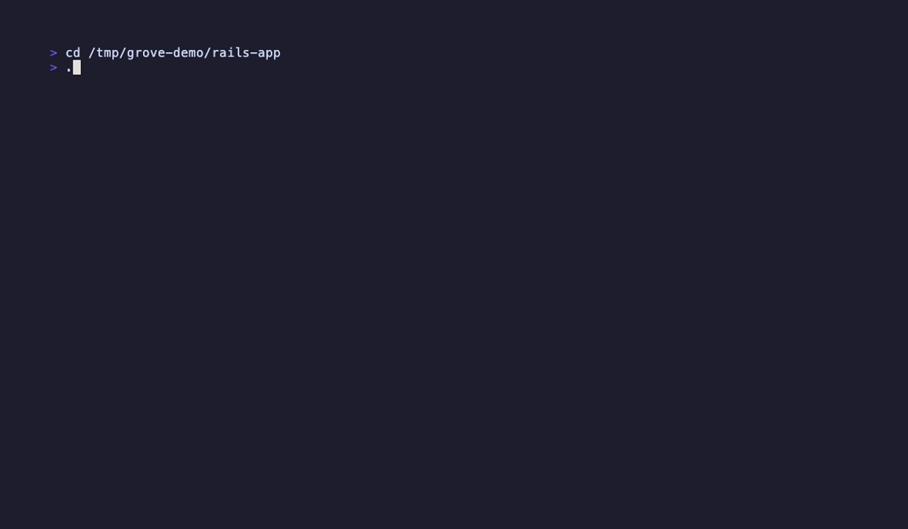

# Grove

> **One command. Your worktree, branch, tmux session, credentials, and Docker stack — ready to go.**

Grove eliminates the mechanical overhead of context-switching between Git branches. Stop juggling 9 shell commands every time you pick up a PR or start a feature. One command does everything.

<!-- Generated by: make demo -->


> **Note:** If the GIF above doesn't render, run `make demo` to generate it locally.

---

## The Problem

You're in flow on a feature. A high-priority PR lands. Reviewing it means:

```bash
gh pr view 42
git fetch origin
git worktree add ../myapp-pr-42 origin/pr-42-branch
cd ../myapp-pr-42
cp ../myapp/.env.local .env.local
ln -s ../myapp/node_modules node_modules
ln -s ../myapp/vendor/bundle vendor/bundle
docker compose up -d
tmux new-session -d -s myapp-pr-42
tmux attach -t myapp-pr-42
```

Nine commands. Easy to miss one. Interrupts your focus every time.

**With Grove:**

```bash
grove fetch pr/42
```

One command. Worktree created. Credentials copied. Dependencies symlinked. Docker running. Tmux session open. You're in.

---

## How It Works

Grove manages **git worktrees** — isolated copies of your repository, each on its own branch, living in separate directories side by side. Think of each worktree as an independent desk: your main work is at one desk, PR review at another, the hotfix at a third. No stashing. No branch switching. No waiting for Docker to restart.

Grove wraps the full worktree lifecycle — create, switch, fork, clean up — and wires in tmux, Docker, and your project's specific setup steps automatically.

---

## Features

| What | How |
|---|---|
| **Interactive TUI Dashboard** | Run `grove` to browse, create, and manage worktrees in a full-screen terminal UI |
| **Fast Context Switching** | `grove to <name>` — changes directory, runs hooks, attaches tmux in <500ms |
| **GitHub Integration** | `grove fetch pr/42` or browse PRs and issues interactively with `grove prs` |
| **Lifecycle Hooks** | Auto-copy `.env`, symlink `node_modules`, run `bundle install` on worktree create |
| **Docker Support** | Start, stop, and tail containers scoped to each worktree — automatically |
| **Tmux Integration** | Every worktree gets its own tmux session; attach, detach, switch without losing context |
| **Shell Integration** | `grove to` actually changes your directory; tab completion included |
| **Agent-Ready** | `GROVE_AGENT_MODE=1` for headless use in CI, scripts, or AI coding tools |

---

## Installation

### Homebrew (recommended)

```bash
brew tap LeahArmstrong/tap
brew install grove
```

Includes automatic updates and shell completions.

### Go Install

```bash
go install github.com/LeahArmstrong/grove-cli/cmd/grove@latest
```

### Release Binaries

Download the latest release for your platform from the [releases page](https://github.com/LeahArmstrong/grove-cli/releases).

```bash
# macOS (Apple Silicon)
curl -L https://github.com/LeahArmstrong/grove-cli/releases/latest/download/grove-cli_v1.0.0_Darwin_arm64.tar.gz | tar xz
sudo mv grove /usr/local/bin/
```

### Build from Source

```bash
git clone https://github.com/LeahArmstrong/grove-cli
cd grove-cli
make build
sudo make install
```

**Requirements:** Git 2.30+, tmux 3.0+ (optional), `gh` CLI (optional for GitHub features), zsh or bash.

---

## Quick Start

### 1 — Shell integration

```bash
grove setup
```

Detects your shell and wires up the integration automatically. Reload your shell when prompted:

```bash
source ~/.zshrc   # or ~/.bashrc
```

> **Why is this needed?** Shell commands run in a subprocess — they can't change your current directory on their own. The integration installs a thin shell function so `grove to` can actually `cd` you into the right place.

<details>
<summary>Manual setup</summary>

Add to your `~/.zshrc` or `~/.bashrc`:

```bash
eval "$(grove install zsh)"   # or bash
```

Then reload: `source ~/.zshrc`
</details>

### 2 — Initialize your project

```bash
cd my-project
grove init
```

Grove detects your project type (Rails, Node, Go, Python, Docker) and generates `.grove/hooks.toml` with sensible defaults — copy `.env`, symlink `node_modules`, run `bundle install`, and so on. Customize to suit your project.

### 3 — Create your first worktree

```bash
grove new feature-login
```

```
✓ Created worktree: myapp-feature-login
✓ Created branch: feature-login
✓ Copied: .env.example → .env
✓ Symlinked: node_modules
✓ Created tmux session: myapp-feature-login
```

### 4 — Switch between worktrees

```bash
grove to feature-login   # switch (changes directory automatically)
grove to main            # switch back
grove last               # toggle to previous worktree
```

### 5 — See all your worktrees

```bash
grove ls
```

```
  NAME             BRANCH           STATUS     TMUX        PATH
  ──────────────────────────────────────────────────────────────────
● main             main             clean      attached    ~/projects/my-app
  feature-login    feat/login       dirty      detached    ~/projects/my-app-feature-login
  hotfix-css       fix/css          clean      none        ~/projects/my-app-hotfix-css
```

`●` marks your current worktree. `dirty` means uncommitted changes. `detached` means a tmux session exists but you're not in it. Use `grove ls --json` for machine-readable output.

### 6 — Open the TUI

```bash
grove
```

No arguments. The full-screen dashboard shows all your worktrees, lets you create, delete, and fork them, browse GitHub PRs, and switch context — all from the keyboard.

---

## The TUI Dashboard

```
 grove
  ❯ feature-login    feat/login    3m ago    ● dirty  ⬡ tmux
    feature-auth     auth          1h ago    ✓ clean  ⬢ tmux
    hotfix-css       fix/css       2d ago    ✓ clean
────────────────────────────────────────────────────────────
  feature-login · b3a1f2c · "add login form validation"
  branch: feat/login  ↑2 ↓0  3 minutes ago
  M cmd/login.go
  M internal/auth/session.go
  + templates/login.html
 [enter] switch  [n] new  [d] delete  [/] filter  [?] help  [q] quit
```

The detail panel updates as you navigate — branch, commit, sync status, tmux state, and a live list of changed files. Toast notifications appear top-right and auto-dismiss after 3 seconds. The layout adapts: side-by-side on wide terminals, stacked on narrow ones.

### Keyboard shortcuts

| Key | Action |
|-----|--------|
| `↑` / `↓` or `k` / `j` | Navigate worktrees |
| `1`–`9` | Quick-switch to the nth worktree |
| `enter` | Switch to selected worktree |
| `n` | Create new worktree |
| `d` | Delete selected worktree |
| `f` | Fork selected worktree |
| `a` | Bulk delete |
| `p` | Browse GitHub PRs |
| `i` | Browse GitHub issues |
| `/` | Filter by name or branch |
| `o` | Cycle sort: name → recent → dirty |
| `c` | Edit config in-TUI |
| `?` | Full keybinding reference |
| `q` | Quit |

See [docs/TUI.md](docs/TUI.md) for the full reference — overlays, PR browser, issue browser, sort modes.

---

## Commands

### Daily workflow

| Command | What it does |
|---------|-------------|
| `grove ls` | List all worktrees — name, branch, status, tmux state |
| `grove new <name>` | Create a worktree + branch + tmux session |
| `grove to <name>` | Switch context: directory, hooks, Docker, tmux |
| `grove to <name> --peek` | Lightweight switch — skip hooks (no Docker side effects) |
| `grove here` | Show current worktree: branch, SHA, age, status |
| `grove last` | Toggle to previous worktree |
| `grove rm <name>` | Remove worktree, kill tmux session, delete branch |
| `grove open <name>` | Open a session in any worktree (create if needed) |
| `grove attach [name]` | Attach to a tmux session without changing directory |

### GitHub integration

Requires `gh` CLI (installed and authenticated to your repo).

| Command | What it does |
|---------|-------------|
| `grove fetch pr/42` | Create a worktree from a GitHub PR |
| `grove fetch issue/123` | Create a worktree from a GitHub issue |
| `grove prs` | Browse open PRs interactively; press enter to fetch |
| `grove issues` | Browse open issues interactively; press enter to start work |

### Cross-worktree operations

| Command | What it does |
|---------|-------------|
| `grove fork <name>` | Fork current worktree into a new one (optionally move or copy WIP) |
| `grove compare <name>` | Diff current worktree against another |
| `grove apply <name>` | Cherry-pick commits or apply WIP from another worktree |
| `grove sync [name]` | Fast-forward a worktree from its remote |
| `grove test <name> [args]` | Run your test command in any worktree without switching |
| `grove clean` | Remove worktrees not accessed in N days (default: 30) |

### Docker

| Command | What it does |
|---------|-------------|
| `grove up` | Start Docker containers for the current worktree |
| `grove down` | Stop Docker containers |
| `grove logs [service]` | Tail container logs |
| `grove restart [service]` | Restart containers |
| `grove up --isolated` | Start an isolated Docker stack (for parallel agent use) |
| `grove ps` | Show active stacks with ports and reference IDs |

### Utilities

| Command | What it does |
|---------|-------------|
| `grove config` | Show the merged effective configuration |
| `grove config --edit` | Edit project config in `$EDITOR` |
| `grove config --hooks` | View or edit hooks configuration |
| `grove init` | Initialize Grove in a git repo |
| `grove setup` | Auto-configure shell integration |
| `grove install <shell>` | Print shell integration code (use in `eval "$(grove install zsh)"`) |
| `grove doctor` | Health check: binary, shell integration, git, tmux, Docker |
| `grove repair` | Fix state inconsistencies and orphaned tmux sessions |
| `grove version` | Show version information |

---

## Hooks

Hooks are commands (or built-in actions like `copy` and `symlink`) that run at worktree lifecycle events. Grove uses them to automate per-worktree setup so you never manually copy `.env` files again.

Configure in `.grove/hooks.toml` (auto-generated by `grove init`, customize to fit your project):

```toml
# Runs once when a new worktree is created
[[hooks.post_create]]
type = "copy"
from = ".env.example"
to = ".env"
required = false

[[hooks.post_create]]
type = "symlink"
from = "vendor/bundle"
to = "vendor/bundle"

[[hooks.post_create]]
type = "command"
command = "bundle install"
timeout = 300
on_failure = "warn"

# Runs after every worktree switch
[[hooks.post_switch]]
type = "command"
command = "git pull origin main --ff-only"
on_failure = "warn"
```

**Hook events:** `pre_create`, `post_create`, `pre_switch`, `post_switch`, `pre_remove`, `post_remove`

**Hook types:**
- `copy` — copies a file from the main worktree into the new one
- `symlink` — symlinks a shared directory (e.g., `node_modules`, `vendor/bundle`) to avoid reinstalling
- `command` — runs an arbitrary shell command inside the worktree

See [docs/PLUGIN_DEVELOPMENT.md](docs/PLUGIN_DEVELOPMENT.md) for writing custom plugins.

---

## Configuration

Grove uses TOML config files. Later files override earlier ones:

1. Built-in defaults
2. `~/.config/grove/config.toml` — global preferences (applies to all projects)
3. `.grove/config.toml` — project-level config (commit this to your repo)

```toml
# .grove/config.toml
project_name = "my-project"

[switch]
# What to do with uncommitted changes when switching
# "prompt" (default) | "auto-stash" | "refuse"
dirty_handling = "prompt"

[tmux]
# "auto" (default) | "manual" | "off"
# auto:   Grove creates and attaches sessions automatically
# manual: Grove creates sessions but doesn't attach (good for scripts)
# off:    No tmux integration
mode = "auto"

[test]
command = "bin/rails test"
# service = "app"   # exec into this Docker service instead of running locally

[session]
# command = "claude"   # what to run when opening a session via 'grove open'
# popup = true         # open in a tmux popup overlay

[plugins.docker]
enabled = true
auto_start = true    # start containers when switching to a worktree
auto_stop = false    # stop containers when switching away

[protection]
protected = ["production"]   # requires --force --unprotect to delete
immutable = ["main"]         # blocks apply/sync; can still be removed
```

Run `grove config` to see the merged effective config for the current project.

### Environment variables

| Variable | Purpose |
|----------|---------|
| `GROVE_AGENT_MODE=1` | Suppress tmux attachment; activate isolated Docker for parallel use |
| `GROVE_TUI=0` | Disable TUI; bare `grove` prints usage instead of the dashboard |
| `GROVE_NONINTERACTIVE=1` | Auto-accept all prompts — useful in CI and scripts |
| `GROVE_LOG=1` | Write debug logs to `~/.grove/grove.log` |
| `GROVE_NO_COLOR=1` | Disable color output |
| `GROVE_HIGH_CONTRAST=1` | High-contrast TUI rendering for accessibility |
| `GROVE_CONFIG=<path>` | Override global config path |

---

## Docker Integration

Grove's Docker plugin handles containers scoped to each worktree. Three modes:

### Local (default)

Each worktree runs its own `docker-compose.yml`. Grove auto-starts and auto-stops containers on context switch.

```toml
[plugins.docker]
enabled = true
auto_start = true
auto_stop = false   # keep stacks running side-by-side (mind port conflicts)
```

### External

One shared compose directory orchestrates services for all worktrees. Grove writes the active worktree path to an env file and injects it into every compose command — so containers mount the right code automatically.

```toml
[plugins.docker]
mode = "external"

[plugins.docker.external]
path = "~/projects/shared-infra"
env_var = "APP_DIR"
services = ["app", "app_worker"]
copy_files = ["config/master.key"]
symlink_dirs = ["vendor/bundle", "node_modules"]
```

On `grove to feature-x`: stop current stack → update `APP_DIR` → start new stack. Atomic.

### Agent isolation

Multiple agents, each with their own Docker stack and port offsets. No conflicts.

```bash
grove up --isolated      # allocate next available slot
grove ps --json          # see all running stacks
grove down               # stop the current worktree's isolated stack
```

```toml
[plugins.docker.external.agent]
max_slots = 5
url_pattern = "http://localhost:{port}"
```

See [plugins/docker/README.md](plugins/docker/README.md) for the full reference.

---

## For AI Agents

Grove works seamlessly with AI coding tools like Claude Code, Cursor, and CI agents.

```bash
# Set at the start of any agent session
export GROVE_AGENT_MODE=1       # suppress tmux takeover
export GROVE_NONINTERACTIVE=1   # no interactive prompts

# Each agent gets its own isolated worktree
grove new agent-task-1
grove new agent-task-2

# Each gets an independent Docker stack with offset ports
cd ../myapp-agent-task-1 && grove up --isolated   # slot 1
cd ../myapp-agent-task-2 && grove up --isolated   # slot 2

# Clean up when done
grove rm agent-task-1
grove rm agent-task-2
```

Built-in quick reference:

```bash
grove agent-help
```

See [docs/AGENT_GUIDE.md](docs/AGENT_GUIDE.md) for the full agent reference — Docker strategies, parallel patterns, CI configuration, and troubleshooting.

---

## Troubleshooting

### Start here: `grove doctor`

```bash
grove doctor
# ✓ Grove binary (/opt/homebrew/bin/grove)
# ✓ Shell integration (v3, current)
# ✓ Git (2.43.0)
# ✓ Tmux (3.4)
# ✓ Docker running (v27.1.1)
# ✓ Config (loaded)
# ✓ Config symlinks (4 worktrees checked)
```

Works outside a Grove project to diagnose installation issues, or inside a project for full health checks including Docker, config validity, and symlink health.

### Common issues

| Symptom | Fix |
|---------|-----|
| `grove: command not found` | Binary not in `$PATH` — check `brew --prefix` or `$GOPATH/bin` |
| `grove to` doesn't change directory | Shell integration not loaded — run `grove setup` and reload shell |
| `not a grove project` | Run `grove init` from the project root |
| Port conflicts between worktrees | Enable `auto_stop = true` or use `grove up --isolated` |
| Stale tmux sessions after manual removal | Run `grove repair` |
| `grove to` unexpectedly attaches tmux | Set `GROVE_AGENT_MODE=1` or `[tmux] mode = "manual"` in config |

See [docs/AGENT_GUIDE.md](docs/AGENT_GUIDE.md#8-troubleshooting) for in-depth troubleshooting including shell PATH edge cases and Docker configuration diagnostics.

---

## Development

```bash
make build    # Build binary to bin/grove
make test     # Run tests with race detection
make lint     # golangci-lint + go vet + gofmt
make fmt      # Format code
make install  # Install to $GOPATH/bin
```

```bash
make test-integration   # Integration tests (requires git)
make test-coverage      # Generate coverage.html
make golden-diff        # Update golden files and show visual changes
make test-fixture       # Create test fixture for live TUI testing
```

See [CONTRIBUTING.md](CONTRIBUTING.md) for the full development guide — CI pipeline, release process, and test infrastructure.

---

## Documentation

| Document | What's in it |
|----------|-------------|
| [docs/TUI.md](docs/TUI.md) | Full TUI reference — keybindings, overlays, sort modes, layout |
| [docs/SHELL_INTEGRATION.md](docs/SHELL_INTEGRATION.md) | Directive protocol, tab completion internals, troubleshooting |
| [docs/AGENT_GUIDE.md](docs/AGENT_GUIDE.md) | AI agent patterns, Docker strategies, before/after comparisons |
| [docs/CONFIGURATION_REFERENCE.md](docs/CONFIGURATION_REFERENCE.md) | All config.toml fields with defaults |
| [docs/COMMAND_SPECIFICATIONS.md](docs/COMMAND_SPECIFICATIONS.md) | Exhaustive command behavior specs |
| [docs/PLUGIN_DEVELOPMENT.md](docs/PLUGIN_DEVELOPMENT.md) | Writing custom hooks and plugins |
| [plugins/docker/README.md](plugins/docker/README.md) | Docker plugin full reference |
| [plugins/tracker/README.md](plugins/tracker/README.md) | GitHub tracker plugin reference |

---

## License

Apache 2.0 — see [LICENSE](LICENSE)
