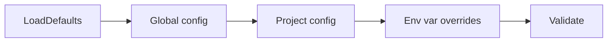
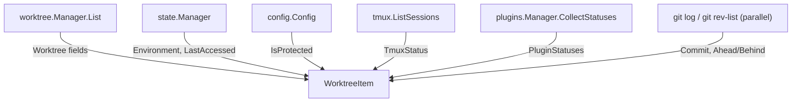
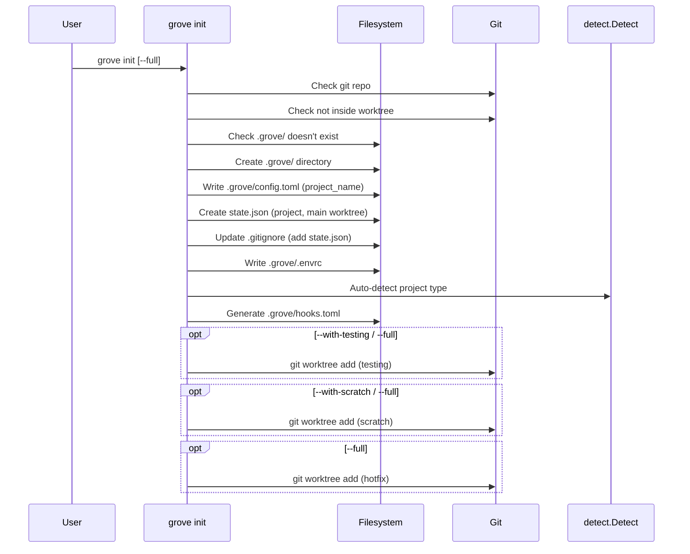
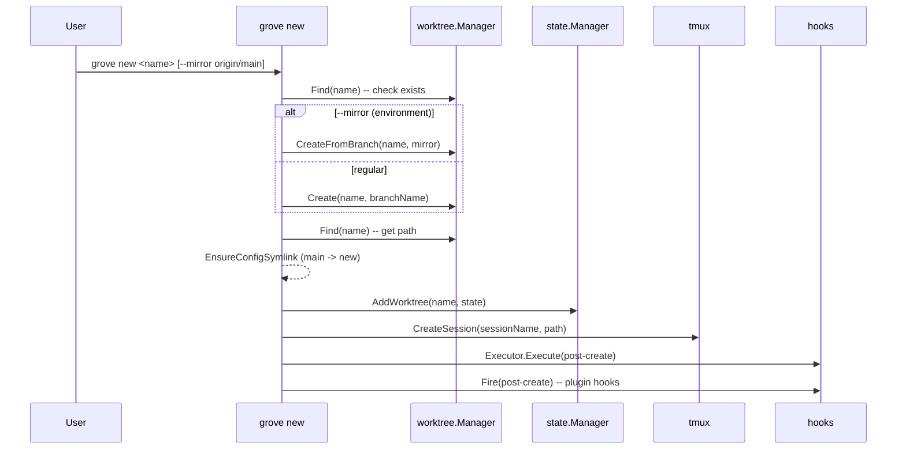
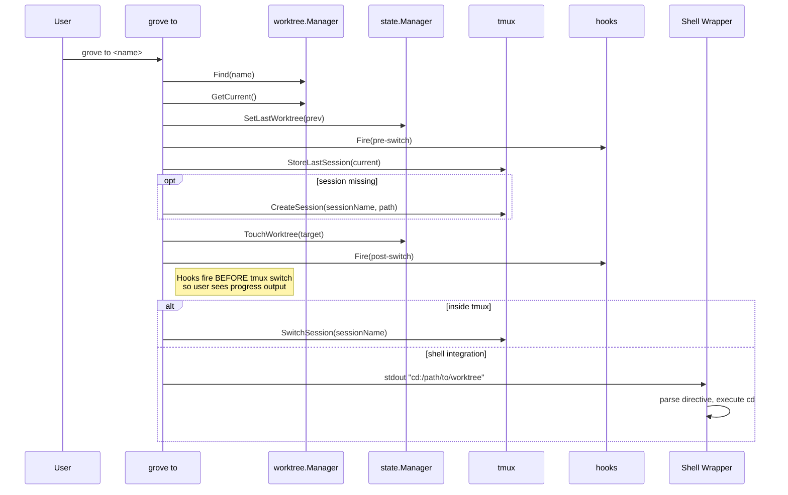
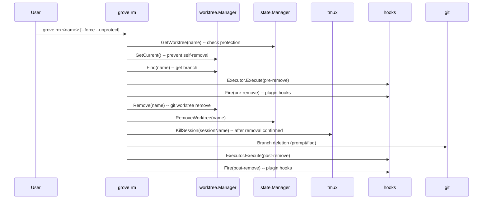
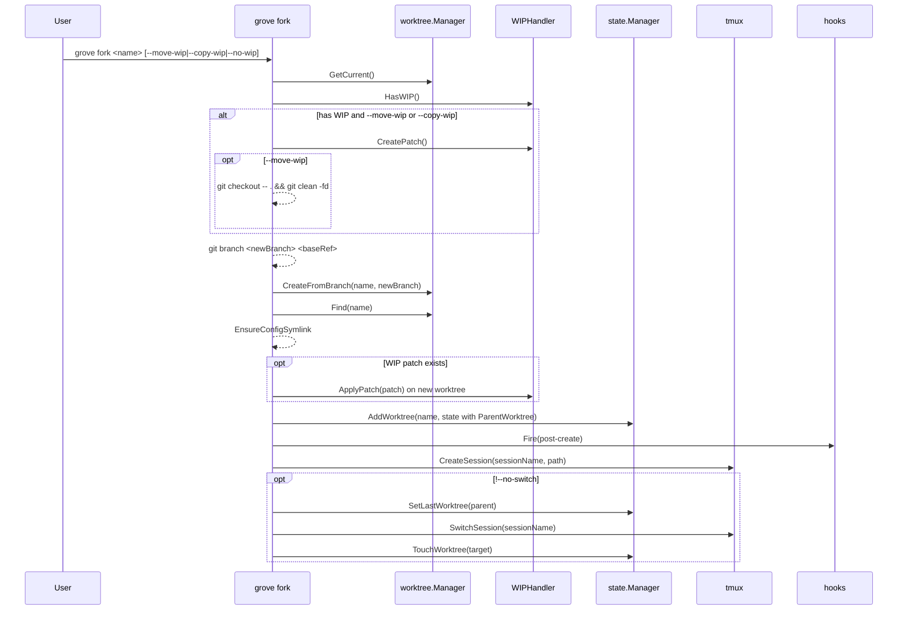

# Grove Data Flows

Reference document covering data models, user command flows, state invariants, and concerning data flow patterns in the Grove CLI.

## Data Models

### config.Config

**Source:** `internal/config/config.go`, `internal/config/defaults.go`

```
Config
  ProjectName   string           # from .grove/config.toml
  Alias         string           # default: "w"
  ProjectsDir   string           # default: ~/projects
  DefaultBranch string           # default: "main"
  Switch        SwitchConfig     # dirty_handling: "prompt" | "auto-stash" | "refuse"
  Naming        NamingConfig     # pattern: "{type}/{description}"
  Tmux          TmuxConfig       # mode: "auto" | "manual" | "off", prefix: ""
  Plugins       PluginsConfig    # docker plugin config
  Protection    ProtectionConfig # protected/immutable worktree lists
  TUI           TUIConfig        # skip_branch_notice, default_branch_action, worktree_name_from_branch
  Test          TestConfig       # command, service
  NoColor        bool            # runtime only (GROVE_NO_COLOR)
  Debug          bool            # runtime only (GROVE_DEBUG)
  NonInteractive bool            # runtime only (GROVE_NONINTERACTIVE)
```

**Load chain** (each layer overrides the previous):



1. **Defaults** -- `LoadDefaults()` in `defaults.go` returns hardcoded defaults
2. **Global config** -- `~/.config/grove/config.toml` (overridden by `GROVE_CONFIG` env var)
3. **Project config** -- `.grove/config.toml` in the project root (or `groveDir/config.toml` when loaded via `LoadFromGroveDir`)
4. **Environment overrides** -- `GROVE_NO_COLOR`, `GROVE_DEBUG`, `GROVE_NONINTERACTIVE` (runtime-only, not persisted)
5. **Validation** -- `Validate()` in `validate.go` checks required fields and enum values

**Merge behavior:** `mergeConfigs()` does field-by-field override -- non-zero/non-nil values in the override replace the base. Protection lists (`Protected`, `Immutable`) use **deduplicated union** semantics -- project-level protections are merged with global protections so that global protections are never silently lost (CF-5 resolved).

### state.State + state.WorktreeState

**Source:** `internal/state/state.go`, `internal/state/migrate.go`

```
State
  Version      int                          # CurrentVersion = 1
  Project      string                       # project name
  LastWorktree string                       # last active worktree short name
  Worktrees    map[string]*WorktreeState    # keyed by short name
```

```
WorktreeState
  Path           string     # absolute filesystem path
  Branch         string     # git branch name
  Root           bool       # true for main worktree
  DockerProject  string     # docker compose project name
  CreatedAt      time.Time
  LastAccessedAt time.Time
  ParentWorktree string     # set by grove fork
  Environment    bool       # true for --mirror worktrees
  Mirror         string     # remote ref being tracked (e.g., "origin/main")
  LastSyncedAt   *time.Time # last grove sync time
  AgentSlot      int        # 0 = no agent stack
```

**Persistence:** `.grove/state.json` in the project root (main worktree only).

**Atomic write mechanism:** `save()` acquires a cross-process file lock (`syscall.Flock` on `.grove/state.lock`), writes to `state.json.tmp`, then `os.Rename()` to `state.json`. The Manager also holds an in-process `sync.RWMutex` for goroutine safety (CF-1 mitigated).

**Version migration:** `migrateStateVersion()` handles V0 -> V1 (sets version number). `MigrateFromLegacy()` handles migration from the old global `frozen.json` format.

### worktree.Worktree

**Source:** `internal/worktree/worktree.go`, `internal/worktree/naming.go`

```
Worktree
  Name          string  # directory basename (e.g., "grove-cli-testing")
  Path          string  # absolute path
  Branch        string  # branch name or "detached"
  Commit        string  # full commit hash
  ShortCommit   string  # 7-char hash (populated by GetCurrent)
  CommitMessage string  # subject line (populated by GetCurrent)
  CommitAge     string  # relative time (populated by GetCurrent)
  IsDirty       bool    # uncommitted changes present
  DirtyFiles    string  # git status --porcelain output
  IsMain        bool    # true for main worktree
  ShortName     string  # name minus project prefix (e.g., "testing")
  IsPrunable    bool    # directory missing (stale)
```

**Computed from:** `git worktree list --porcelain` parsed by `parseWorktreeList()`. The Manager additionally runs `git status --porcelain` per worktree to set `IsDirty`.

**Project name detection** (in `naming.go`):
1. `.grove/config.toml` `project_name` in main worktree
2. `git remote get-url origin` -- extract repo name
3. Main worktree directory name as fallback

**Naming convention:** `FullName()` returns `{project}-{name}`. Worktree directories live in the **parent** of the repo root: `filepath.Dir(repoRoot) + "/" + fullName`.

### tmux.Session

**Source:** `internal/tmux/session.go`

```
Session
  Name     string  # session name
  Windows  int     # window count
  Attached bool    # currently attached
  Created  string  # creation timestamp
```

**Populated from:** `tmux list-sessions -F "#{session_name}|#{session_windows}|#{session_attached}|#{session_created}"`

**Session naming:** `worktree.TmuxSessionName(project, name)` returns `project` for root, `project-name` for branches.

**Last session tracking:** `StoreLastSession()` writes to `~/.config/grove/last_session` (plain text file, direct `os.WriteFile` -- no atomic write).

### tui.WorktreeItem

**Source:** `internal/tui/data.go`

```
WorktreeItem
  ShortName      string
  FullName       string
  Path           string
  Branch         string
  Commit         string     # short hash
  CommitMessage  string
  CommitAge      string
  IsDirty        bool
  DirtyFiles     []string
  IsMain         bool
  IsCurrent      bool
  IsEnvironment  bool
  IsProtected    bool
  IsPrunable     bool
  TmuxStatus     string                  # "attached" | "detached" | "none"
  HasRemote      bool
  AheadCount     int
  BehindCount    int
  LastAccessed   time.Time
  PluginStatuses []plugins.StatusEntry
```

**View model** that joins data from four sources in `FetchWorktrees()`:



**Parallelism:** Git calls (commit info, dirty files, upstream counts) run in parallel goroutines per worktree. Plugin status collection also runs concurrently via `sync.WaitGroup`.

### hooks.HooksConfig

**Source:** `internal/hooks/config.go`, `internal/hooks/hooks.go`, `internal/hooks/executor.go`

```
HooksConfig
  Hooks     EventHooks   # per-event action lists
  Overrides []Override   # branch/worktree glob overrides

EventHooks
  PreCreate, PostCreate   []HookAction
  PreSwitch, PostSwitch   []HookAction
  PreRemove, PostRemove   []HookAction
  Override* flags          bool  # if true, project replaces (not appends) global

HookAction
  Type       string  # "copy" | "symlink" | "command" | "template"
  From, To   string  # source/dest paths (relative or absolute)
  Command    string  # shell command (for "command" type)
  WorkingDir string  # "new" | "main" | absolute
  Timeout    int     # seconds (default: 60)
  Required   bool    # if true, failure aborts
  OnFailure  string  # "warn" | "fail" | "ignore"
  Vars       map[string]string  # template variables

Override
  Match     string    # glob pattern on branch or worktree name
  SkipHooks bool      # skip all hooks for match
  Skip      []string  # skip specific action types
  ExtraCopy []string  # additional files to copy
  ExtraRun  []string  # additional commands to run
```

**Load chain:** Global `~/.config/grove/hooks.toml` merged with project `.grove/hooks.toml`. Project hooks **append** to global unless `override_*` flag is set (then project replaces global for that event).

**Two hook systems:** There are two independent hook systems that both fire during lifecycle events:
1. **Executor** (user-configured) -- TOML-based actions from `hooks.toml`, executed via `hooks.Executor`
2. **Registry** (plugin-based) -- Go functions registered via `hooks.Registry`, fired via `hooks.Fire()`

### plugins.Plugin

**Source:** `internal/plugins/plugin.go`, `plugins/docker/`, `plugins/tracker/`

```
Plugin interface
  Name() string
  Init(cfg *Config) error
  RegisterHooks(registry *hooks.Registry) error
  Enabled() bool

StatusProvider interface (optional)
  WorktreeStatuses(worktreePaths []string) map[string]StatusEntry

StatusEntry
  ProviderName string       # e.g., "docker"
  Level        StatusLevel  # None | Info | Active | Warning | Error
  Short        string       # compact label for tables
  Detail       string       # longer description for TUI detail pane
```

**Plugin lifecycle:** `Manager.Register()` calls `Init()` on the plugin. `Manager.RegisterHooks()` calls `RegisterHooks()` on enabled plugins. `Manager.CollectStatuses()` calls `WorktreeStatuses()` on enabled `StatusProvider` plugins in parallel.

**Registered plugins:** `docker` (local/external compose management, agent stacks) and `tracker` (GitHub issue tracking).

---

## User Command Flows

### Project Bootstrap: `grove init`

**Source:** `cmd/grove/commands/init.go`



**Key details:**
- Detects project name from: config -> git remote -> directory name
- Detects main branch via `git rev-parse`
- Registers main worktree as "main" with `Root: true` in state
- Auto-generates `hooks.toml` based on detected project type (Rails, Node, Go, Python, Docker)
- `grove setup` is a hidden alias for `grove init`

### Worktree Creation: `grove new`

**Source:** `cmd/grove/commands/new.go`



**Step ordering:** State is written (step 4) before tmux session creation (step 5) and hook execution (steps 6-7). If tmux or hooks fail, state already contains the worktree entry. State write errors are now surfaced as warnings with `grove repair` guidance (CF-2 resolved).

### Worktree Switching: `grove to`

**Source:** `cmd/grove/commands/to.go`



**Shell integration protocol:** Commands that change directories output `cd:/path` on stdout. The shell wrapper function (installed via `eval "$(grove install zsh)"`) captures stdout of directive-producing commands (`to`, `last`, `fork`, `fetch`, `attach`), parses for `cd:` and `tmux-attach:` prefixes, and executes the corresponding shell operations.

### Worktree Removal: `grove rm`

**Source:** `cmd/grove/commands/rm.go`



**Protection checks:** A worktree is protected if it appears in `config.Protection.Protected` OR if `state.WorktreeState.Environment == true`. Removal requires both `--force` and `--unprotect`.

**Step ordering:** Worktree is removed first, then state is cleaned up, then the tmux session is killed. This ensures that if worktree removal fails, the user retains their tmux session. State removal errors are surfaced as warnings (CF-2 resolved).

### Worktree Fork: `grove fork`

**Source:** `cmd/grove/commands/fork.go`



**WIP handling:** With `--move-wip`, the source working tree is reset only **after** the new worktree is created and the patch is successfully applied. If any step fails before patch application, WIP is preserved in the source worktree (CF-8 resolved).

### State Repair: `grove repair`

**Source:** `cmd/grove/commands/repair.go`

Detects and fixes three types of inconsistencies:

1. **Orphan state entries** -- state references a worktree whose directory no longer exists. Action: remove from state.
2. **Missing state entries** -- git worktree exists but has no state entry. Action: add to state with best-guess timestamps.
3. **Orphan tmux sessions** -- tmux session with project prefix has no corresponding worktree. Action: kill session.

Runs interactively with confirmation prompt (or `--dry-run` to preview).

### Shell Integration Protocol

**Source:** `internal/shell/integration.go`, `internal/shell/templates/grove.zsh`

```
eval "$(grove install zsh)"
```

This generates a shell function that wraps the grove binary:
- **Directive commands** (`to`, `last`, `fork`, `fetch`, `attach`): stdout is captured and parsed for directives
- **All other commands**: run directly for streaming output
- **Directives:** `cd:/path` triggers `cd`, `tmux-attach:session` triggers `tmux attach-session -t`
- Sets `GROVE_SHELL=1` environment variable so the binary knows shell integration is active

### TUI Data Loading

**Source:** `internal/tui/data.go`

`FetchWorktrees()` is the single entry point for TUI data. It:

1. Calls `worktree.Manager.List()` (parses `git worktree list --porcelain`)
2. Loads `config.Config` for protection checks
3. Gets current worktree via `worktree.Manager.GetCurrent()`
4. Lists tmux sessions and builds a name-keyed lookup map
5. For each worktree, sets base fields (name, path, branch, dirty, main, current, prunable)
6. Matches tmux sessions by `TmuxSessionName(project, shortName)` or full name fallback
7. Queries state for environment status and last accessed time
8. Checks config for protection status
9. **In parallel goroutines per worktree:** fetches commit info, dirty files, upstream counts
10. **In parallel:** collects plugin statuses via `plugins.Manager.CollectStatuses()`
11. Waits for all goroutines, attaches plugin statuses to items

---

## State Invariants

These invariants should hold during normal operation. `grove repair` can restore INV-1 and INV-2.

### INV-1: Worktree-State Correspondence

Every non-root git worktree should have a corresponding entry in `state.Worktrees`, and every state entry should point to an existing worktree directory.

**Enforced by:** `grove new` and `grove fork` add state entries after creation. `grove rm` removes state entries after deletion. `grove repair` detects and fixes mismatches.

**Violation scenario:** A worktree created outside grove (e.g., `git worktree add` directly) will have no state entry. A worktree removed outside grove will leave an orphan state entry.

### INV-2: Tmux-Worktree Correspondence

Every tmux session with the project prefix should correspond to an existing worktree.

**Enforced by:** `grove new`/`grove fork` create sessions. `grove rm` kills sessions. `grove repair` detects orphan sessions.

**Violation scenario:** Killing a tmux session manually leaves no orphan (grove creates on demand). Removing a worktree outside grove leaves an orphan tmux session.

### INV-3: State Version Validity

`state.Version` must equal `state.CurrentVersion` (currently 1).

**Enforced by:** `migrateStateVersion()` during load. V0 states are migrated to V1 automatically.

### INV-4: Config Validation

Config must pass `Validate()`: non-empty alias and default_branch, valid enum values for `dirty_handling` (auto-stash/prompt/refuse), `tmux.mode` (auto/manual/off), `docker.mode` (local/external). External docker mode requires path, env_var, and services.

**Enforced by:** `Validate()` called at the end of every `Load()`.

### INV-5: Worktree Naming Convention

Worktree directories follow `{project}-{name}` pattern. Root worktree keeps its original directory name.

**Enforced by:** `worktree.Manager.FullName()` always prepends project name. `worktree.Manager.Create()` and `CreateFromBranch()` use `FullName()`.

### INV-6: Last Worktree Consistency

`state.LastWorktree` should reference a worktree that exists (or be empty).

**Partially enforced:** Set during `grove to` and `grove fork` before switching. Not cleaned up when the referenced worktree is removed.

### INV-7: Environment Worktree Properties

Environment worktrees (`state.Environment == true`) must have `Mirror` set. They are implicitly protected (require `--force --unprotect` to remove).

**Enforced by:** `grove new --mirror` sets both fields. `grove rm` checks `Environment` flag for protection.

### INV-8: Protection Source of Truth

Protection status comes from `config.toml` (`Protection.Protected` list), **not** from state. Environment worktrees are additionally protected via the `Environment` state flag.

**Consequence:** Adding/removing a worktree name from the config protected list immediately changes its protection status without any state migration.

---

## Concerning Flows

### CF-1: State File Race Condition — MITIGATED

**Severity:** MEDIUM → LOW
**Files:** `internal/state/state.go`

**Resolution:** `save()` now acquires a cross-process file lock (`syscall.Flock` on `.grove/state.lock`) before writing, following the same pattern as `plugins/docker/slots.go`. The in-process `sync.RWMutex` remains for goroutine safety. The read-modify-write cycle is now protected at both the process and goroutine level.

**Remaining caveat:** The lock protects writes but not the full read-modify-write cycle. A process that holds state in memory for an extended period before writing could still produce a stale write. In practice, grove commands complete quickly and this is unlikely.

### CF-2: Non-Transactional Multi-Step Operations — RESOLVED

**Severity:** HIGH → LOW
**Files:** `cmd/grove/commands/new.go`, `cmd/grove/commands/fork.go`, `cmd/grove/commands/rm.go`

**Resolution:** Three changes reduce the impact of partial failures:

1. **State errors surfaced:** `new.go` and `fork.go` no longer silently discard `AddWorktree()` errors — they print warnings with `grove repair` guidance. `rm.go` does the same for `RemoveWorktree()`.

2. **`grove rm` reordered:** Tmux session kill moved to after worktree removal. If `mgr.Remove()` fails, the user retains their tmux session and can investigate.

3. **`grove fork` WIP safe:** Source reset moved to after patch application (see CF-8).

**Remaining failure modes** (acceptable):
- Worktree created + state written, tmux fails → functional but no tmux session
- Worktree + state + tmux created, hooks fail → functional but hooks not applied
- `grove rm`: worktree + state removed, branch deletion fails → stale branch (manual cleanup)

### CF-3: Tmux/Worktree Desynchronization

**Severity:** LOW
**Files:** `internal/tmux/session.go`, `internal/tui/data.go` (lines 143-187)

Tmux session state is not persisted by grove -- it's queried live from tmux. Sessions can be created/killed outside grove, and worktrees can be created/removed outside grove, leading to mismatches.

**Scenarios:**
- User kills tmux session manually: grove recreates it on next `grove to`
- User creates tmux session with project prefix manually: `grove repair` may flag it as orphan
- Tmux server crashes: all sessions lost, recreated on demand

**Mitigation:** Sessions are created on demand during `grove to`. `grove repair` cleans orphan sessions.

### CF-4: Last Session Tracking Non-Atomic Write — RESOLVED

**Severity:** LOW
**Files:** `internal/tmux/session.go`

**Resolution:** `StoreLastSession()` now uses temp file + `os.Rename()` for atomic writes, matching the pattern used in `state.Manager.save()`.

### CF-5: Config Protection Merge — RESOLVED

**Severity:** MEDIUM
**Files:** `internal/config/config.go`

**Resolution:** Protection lists now use **deduplicated union** semantics via `deduplicatedUnion()`. Project-level protections are merged with global protections, preserving order and removing duplicates.

```toml
# ~/.config/grove/config.toml
[protection]
protected = ["main", "production"]

# .grove/config.toml
[protection]
protected = ["staging"]
# Result: ["main", "production", "staging"] — all three are protected.
```

### CF-8: Fork WIP Data Loss — RESOLVED

**Severity:** HIGH
**Files:** `cmd/grove/commands/fork.go`

**Resolution:** The destructive source reset (`git checkout -- .` + `git clean -fd`) was moved to **after** successful patch application. New sequence:

1. `CreatePatch()` — non-destructive
2. Create branch
3. Create worktree
4. Apply patch to new worktree
5. **Reset source** — only after patch applied successfully

If any step before patch application fails, WIP is preserved in the source worktree. If the reset itself fails after a successful fork, the changes exist in both locations (safe). Reset errors are surfaced as warnings.
