# Grove-CLI Tool Breakdown

Comprehensive documentation of every Grove command's behavior, system changes, and operational safety analysis.

**Generated**: 2026-01-20
**Grove Version**: 0.1.0-dev

---

## Table of Contents

- [Overview](#overview)
- [Core Lifecycle Commands](#core-lifecycle-commands)
  - [grove init](#grove-init)
  - [grove new](#grove-new)
  - [grove rm](#grove-rm)
  - [grove ls](#grove-ls)
  - [grove here](#grove-here)
- [Navigation Commands](#navigation-commands)
  - [grove to](#grove-to)
  - [grove last](#grove-last)
  - [grove freeze](#grove-freeze)
  - [grove resume](#grove-resume)
- [Git Operations](#git-operations)
  - [grove fetch](#grove-fetch)
  - [grove up](#grove-up)
  - [grove down](#grove-down)
  - [grove logs](#grove-logs)
  - [grove browse (issues/prs)](#grove-browse)
- [Session & Config](#session--config)
  - [grove restart](#grove-restart)
  - [grove time](#grove-time)
  - [grove config](#grove-config)
  - [grove version](#grove-version)
- [Internal Architecture](#internal-architecture)
  - [Package Overview](#package-overview)
  - [worktree Package](#worktree-package)
  - [tmux Package](#tmux-package)
  - [shell Package](#shell-package)
  - [state Package](#state-package)
  - [hooks Package](#hooks-package)
  - [config Package](#config-package)
  - [plugins Package](#plugins-package)
- [Plugins](#plugins)
  - [Docker Plugin](#docker-plugin)
  - [Time Plugin](#time-plugin)
  - [Tracker Plugin](#tracker-plugin)
- [Safety Summary](#safety-summary)

---

## Overview

Grove is a CLI tool for managing git worktrees with tmux integration. It provides:

- **Worktree lifecycle management** (create, list, remove, switch)
- **Tmux session automation** (auto-create sessions per worktree)
- **Shell integration** (directory switching via `cd:` protocol)
- **State persistence** (frozen worktrees, time tracking)
- **Plugin system** (Docker, time tracking, GitHub integration)

### Naming Convention

All worktrees follow the `{project}-{name}` pattern:
- Directory: `grove-cli-testing`
- Tmux session: `grove-cli-testing`
- Display name: `testing` (short form)

### Shell Integration Protocol

Commands that change directories output `cd:/path/to/dir` which the shell wrapper intercepts when `GROVE_SHELL=1` is set.

---

## Core Lifecycle Commands

### grove init

**Purpose:** Generate shell integration code for zsh or bash.

**Dependencies:** `internal/shell`

#### Flowchart

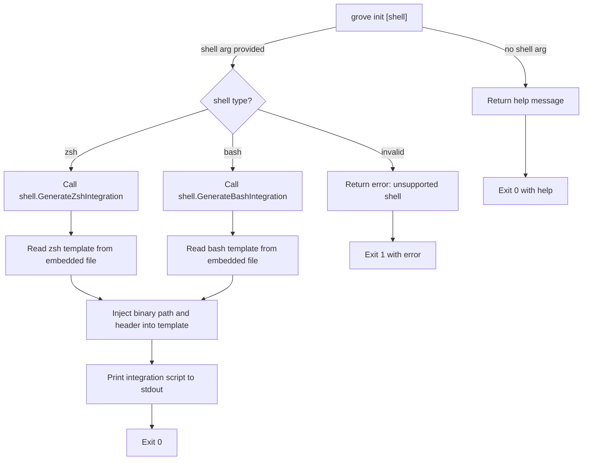

#### System Changes

| Change Type | Description | Condition |
|-------------|-------------|-----------|
| Stdout | Prints shell integration script | Always (when successful) |
| No Files | No persistent changes on disk | Command is read-only output |
| No Tmux | Does not interact with tmux | N/A |
| No Git | Does not interact with git | N/A |

#### Operational Safety

**Data Loss Risk:** None

**What can go wrong:**
- Binary path resolution fails (falls back to "grove" in PATH)
- Invalid shell type specified (returns error with list of supported shells)

**Edge Cases:**
- Already integrated into shell config (re-running is safe, idempotent)

#### Flags and Options

| Flag | Type | Effect |
|------|------|--------|
| `[shell]` | Positional arg | Shell type: `zsh` or `bash` (required) |

---

### grove new

**Purpose:** Create a new git worktree with a new branch and optional tmux session.

**Dependencies:** `internal/worktree`, `internal/tmux`

#### Flowchart

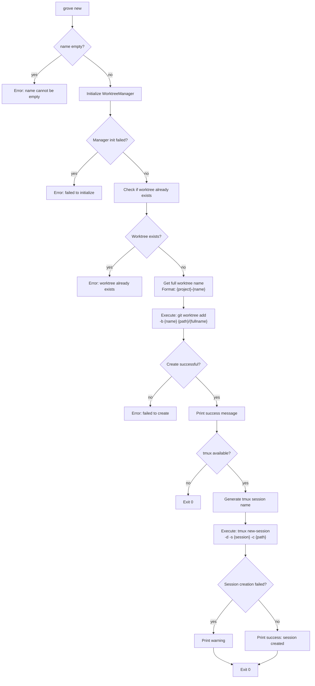

#### System Changes

| Change Type | Description | Condition |
|-------------|-------------|-----------|
| Directory | Creates new worktree directory | Always on success |
| Git | Executes `git worktree add -b {name}` | Always on success |
| Git | Creates new branch with worktree | Always on success |
| Tmux | Creates detached tmux session | When tmux available |
| Filesystem | All files copied from main worktree | Git operation side effect |

#### Operational Safety

**Data Loss Risk:** Low
- Only creates new resources, no deletion
- Idempotency check prevents accidental overwrites

**What can go wrong:**
- Name already exists (error with recovery suggestions)
- Not in a git repo (WorktreeManager initialization fails)
- Permission denied on parent directory
- Disk full

**Recovery:**
- Use `grove rm <name>` to clean up partial creation

#### Flags and Options

| Flag | Type | Effect |
|------|------|--------|
| `<name>` | Positional arg | Worktree name (becomes branch name) |

---

### grove rm

**Purpose:** Remove a git worktree and kill its associated tmux session.

**Dependencies:** `internal/worktree`, `internal/tmux`

#### Flowchart

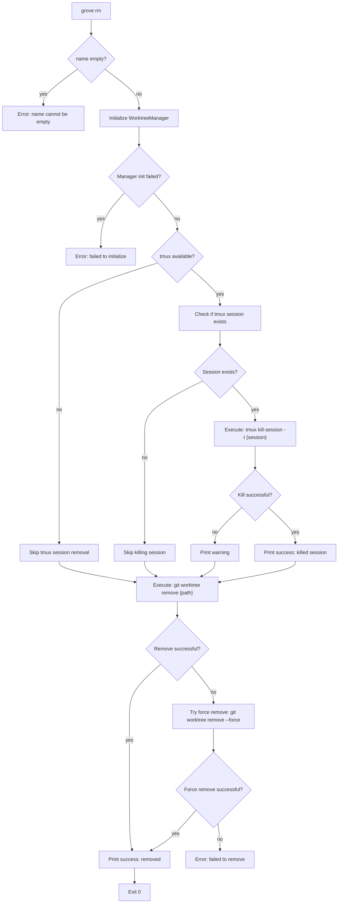

#### System Changes

| Change Type | Description | Condition |
|-------------|-------------|-----------|
| Directory | Deletes worktree directory | When git remove succeeds |
| Git | Executes `git worktree remove {path}` | Always attempted first |
| Git | Executes `git worktree remove --force` | If normal remove fails |
| Git | Executes `git worktree prune` | If worktree is prunable (stale) |
| Tmux | Kills tmux session | When session exists and tmux available |

#### Operational Safety

**Data Loss Risk:** HIGH (destructive)
- Deletes entire worktree directory and uncommitted changes
- **NO confirmation prompt**
- **NO backup created**

**What can go wrong:**
- Worktree has uncommitted changes (deleted without warning)
- Terminal inside removed worktree (shell may break)
- Multiple users accessing same worktree

**Recovery:**
- Uncommitted changes: Lost unless backed up externally
- Use `git reflog` to recover deleted branch refs

#### Flags and Options

| Flag | Type | Effect |
|------|------|--------|
| `<name>` | Positional arg | Worktree name to remove |

**Aliases:** `grove remove`, `grove delete`

---

### grove ls

**Purpose:** List all worktrees with status, branch info, and tmux session status.

**Dependencies:** `internal/worktree`, `internal/tmux`, `internal/state`

#### Flowchart

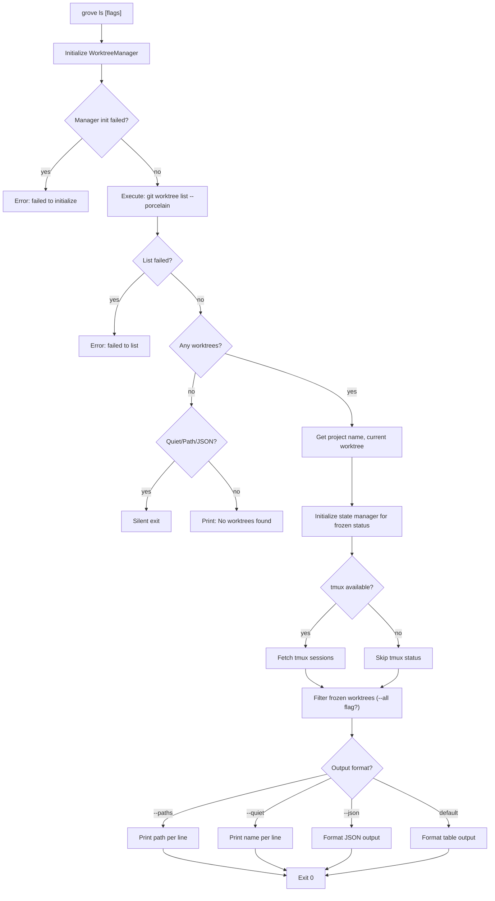

#### System Changes

| Change Type | Description | Condition |
|-------------|-------------|-----------|
| Stdout | Formatted list output | Always on success |
| No Modifications | Read-only operation | All modes |

#### Operational Safety

**Data Loss Risk:** None (read-only)

**Status Indicators:**
- `●` = current worktree
- `clean` = no uncommitted changes
- `dirty` = uncommitted changes present
- `stale` = directory missing (prunable)
- Tmux: `attached` / `detached` / `frozen` / `none`

#### Flags and Options

| Flag | Short | Type | Default | Effect |
|------|-------|------|---------|--------|
| `--all` | `-a` | Boolean | false | Include frozen worktrees |
| `--paths` | `-p` | Boolean | false | Show full paths only |
| `--json` | `-j` | Boolean | false | Output as JSON |
| `--quiet` | `-q` | Boolean | false | Names only, one per line |

---

### grove here

**Purpose:** Display detailed information about the current worktree.

**Dependencies:** `internal/worktree`, `internal/tmux`

#### Flowchart

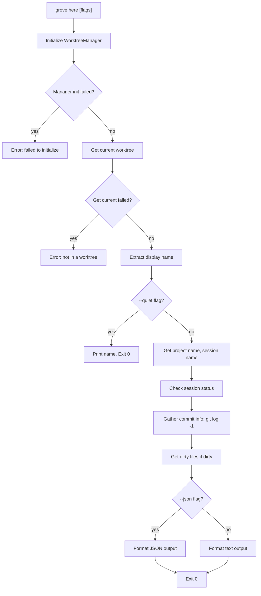

#### System Changes

| Change Type | Description | Condition |
|-------------|-------------|-----------|
| Stdout | Formatted display of current worktree info | Always |
| Git Operations | `git log -1` for commit info | To gather display data |
| Git Operations | `git status --porcelain` for dirty files | Only if worktree is dirty |

#### Operational Safety

**Data Loss Risk:** None (read-only)

#### Flags and Options

| Flag | Short | Type | Default | Effect |
|------|-------|------|---------|--------|
| `--quiet` | `-q` | Boolean | false | Just print worktree name |
| `--json` | `-j` | Boolean | false | Output as JSON |

---

## Navigation Commands

### grove to

**Purpose:** Switch to a worktree by short name, create tmux session if needed, and output directory path for shell integration.

**Dependencies:** `internal/worktree`, `internal/tmux`, `internal/hooks`

#### Flowchart

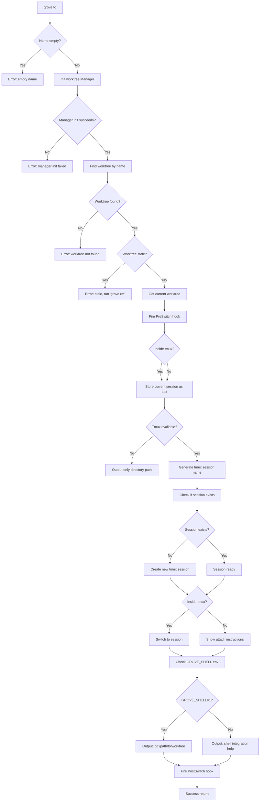

#### System Changes

| Change Type | Description | Condition |
|-------------|-------------|-----------|
| State | Current session stored in `~/.config/grove/last_session` | When inside tmux |
| Tmux | New session created with name `{project}-{name}` | When session doesn't exist |
| Tmux | Switches to target session | When inside tmux |
| Directory | Outputs `cd:/path` protocol line | When `GROVE_SHELL=1` |
| Hooks | Fires `pre-switch` and `post-switch` hooks | Always |

#### Operational Safety

**Data Loss Risk:** Low
- No destructive operations
- Directory switching is non-destructive

**What can go wrong:**
- Stale worktree directory removed externally (caught by `IsPrunable` check)
- Tmux session already exists (properly checked before creation)
- Shell integration not configured (falls back to helpful instructions)

#### Flags and Options

| Flag | Type | Effect |
|------|------|--------|
| `<name>` | Positional arg | Worktree short name to switch to |
| `GROVE_SHELL` | Env var | When `=1`, outputs `cd:/path` for shell wrapper |

---

### grove last

**Purpose:** Switch to the last worktree you were working in (tmux session-based history).

**Dependencies:** `internal/tmux`, `internal/worktree`

#### Flowchart

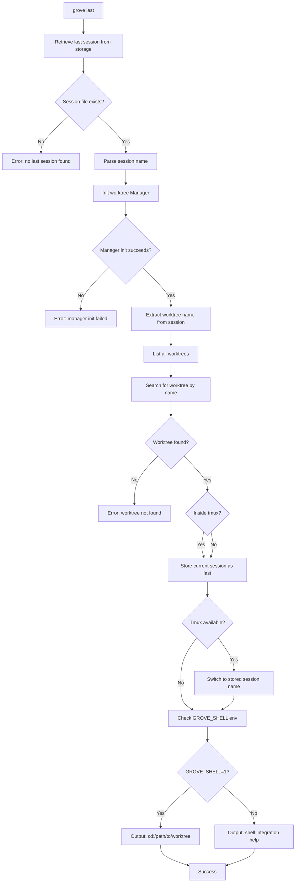

#### System Changes

| Change Type | Description | Condition |
|-------------|-------------|-----------|
| State | Current session stored in `~/.config/grove/last_session` | When inside tmux |
| Tmux | Switches to stored last session | When inside tmux |
| Directory | Outputs `cd:/path` protocol line | When `GROVE_SHELL=1` |

#### Operational Safety

**Data Loss Risk:** Low
- Read-only operation (no state modification except last-session tracking)

**What can go wrong:**
- No previous session history (file doesn't exist on first use)
- Last session doesn't match any worktree (worktree was deleted)

**Edge Cases:**
- Using `last` when not inside tmux (still works if GROVE_SHELL=1)
- Switching back and forth (each call updates last_session)

---

### grove freeze

**Purpose:** Mark a worktree as frozen (inactive) and stop related services like Docker containers.

**Dependencies:** `internal/state`, `internal/worktree`, `internal/hooks`, `plugins/docker`

#### Flowchart

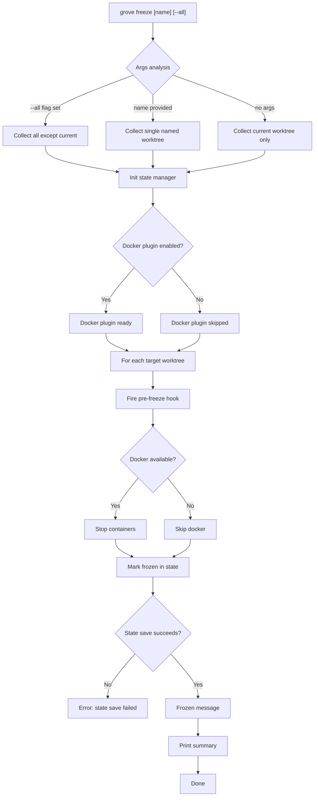

#### System Changes

| Change Type | Description | Condition |
|-------------|-------------|-----------|
| State | Worktree added to `~/.config/grove/state/frozen.json` | For each targeted worktree |
| Hooks | Fires `pre-freeze` hook | For each worktree |
| Docker | Stops containers via `docker-compose down` | When docker plugin enabled |

#### Operational Safety

**Data Loss Risk:** Low (state change is idempotent)
- Freeze is purely metadata marking
- Docker stop is reversible via `resume`

**What can go wrong:**
- Docker containers fail to stop (logged as warning, freeze still completes)
- Hook execution fails (logged as warning, freeze still completes)

#### Flags and Options

| Flag | Type | Effect |
|------|------|--------|
| `[name]` | Optional positional | Specific worktree to freeze |
| `--all` | Boolean | Freeze all except current |

---

### grove resume

**Purpose:** Clear frozen state for a worktree and restart related services like Docker containers.

**Dependencies:** `internal/state`, `internal/worktree`, `internal/hooks`, `internal/tmux`, `plugins/docker`

#### Flowchart

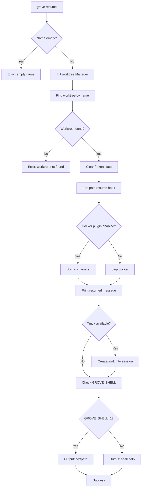

#### System Changes

| Change Type | Description | Condition |
|-------------|-------------|-----------|
| State | Worktree removed from frozen set | Always |
| Hooks | Fires `post-resume` hook | After state cleared |
| Docker | Starts containers via `docker-compose up` | When docker plugin enabled |
| Tmux | Session created if doesn't exist | When tmux available |
| Directory | Outputs `cd:/path` | When `GROVE_SHELL=1` |

#### Operational Safety

**Data Loss Risk:** Low
- Reverse operation of freeze
- Docker start is safe if containers already running (idempotent)

---

## Git Operations

### grove fetch

**Purpose:** Create worktree from GitHub issue or pull request with automatic naming and branch checkout.

**Dependencies:** `internal/worktree`, `internal/tmux`, `plugins/tracker`

#### Flowchart

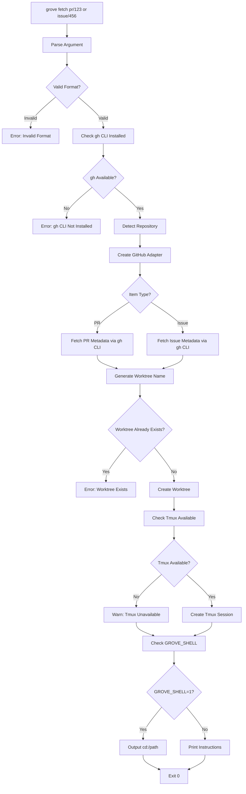

#### System Changes

| Change Type | Description | Condition |
|-------------|-------------|-----------|
| Git | Creates new worktree directory | Always (on success) |
| Git | Checks out PR branch or creates new issue branch | Always |
| Tmux | Creates tmux session | If tmux available |
| GitHub | Fetches PR/issue metadata via `gh` CLI | For both PR and issue types |
| Shell | Outputs `cd:` directive | If `GROVE_SHELL=1` |

#### Operational Safety

**Data Loss Risk:** Low
- Fetch only creates new worktrees, no existing data modified

**External Dependencies:**
- `gh` CLI must be installed and authenticated

---

### grove up

**Purpose:** Start Docker containers for the current worktree using docker-compose.

**Dependencies:** `plugins/docker`

#### Flowchart

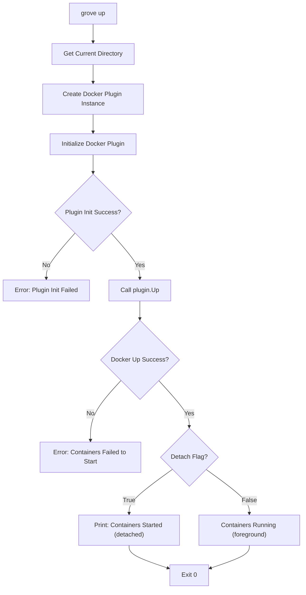

#### System Changes

| Change Type | Description | Condition |
|-------------|-------------|-----------|
| Docker | Starts services from docker-compose.yml | Always |
| Docker | Allocates ports per worktree config | Always |
| Docker | Creates networks for service communication | Always |
| Process | Keeps containers running | When `--detach=true` |

#### Operational Safety

**Data Loss Risk:** Medium
- Volumes persist unless explicitly removed

**What can go wrong:**
- docker-compose.yml not found
- Docker daemon not running
- Port conflicts

#### Flags and Options

| Flag | Short | Type | Default | Effect |
|------|-------|------|---------|--------|
| `--detach` | `-d` | Boolean | `true` | Run containers in background |

---

### grove down

**Purpose:** Stop Docker containers for the current worktree.

**Dependencies:** `plugins/docker`

#### Flowchart

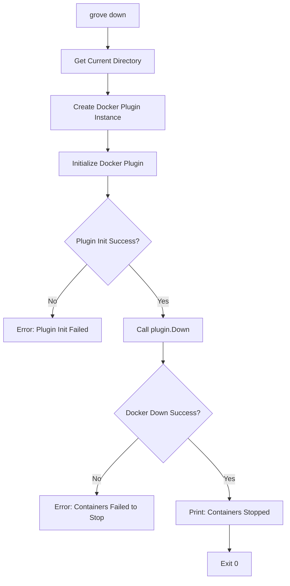

#### System Changes

| Change Type | Description | Condition |
|-------------|-------------|-----------|
| Docker | Stops all running services | Always |
| Docker | Removes container instances | After services stop |
| Docker | Preserves networks and volumes | Always |

#### Operational Safety

**Data Loss Risk:** Low
- Containers stopped but volumes preserved

---

### grove logs

**Purpose:** View Docker container logs with optional follow mode.

**Dependencies:** `plugins/docker`

#### System Changes

| Change Type | Description | Condition |
|-------------|-------------|-----------|
| Process | Streams output from containers | Always |
| Terminal | Blocks with continuous output | When `--follow=true` |

#### Operational Safety

**Data Loss Risk:** None (read-only)

#### Flags and Options

| Flag | Short | Type | Default | Effect |
|------|-------|------|---------|--------|
| `--follow` | `-f` | Boolean | `true` | Follow log output like `tail -f` |
| `[service]` | Positional | String | all | Service name to show logs from |

---

### grove browse

**Purpose:** Interactive GitHub issue/PR browser using fzf for fuzzy selection.

**Dependencies:** `plugins/tracker`, external `fzf`

#### System Changes

| Change Type | Description | Condition |
|-------------|-------------|-----------|
| GitHub API | Fetches issue/PR list | Always |
| Process | Spawns fzf subprocess | When issues/PRs found |
| Terminal | Blocks with interactive UI | Until user selects or cancels |
| Git | Creates worktree from selection | When user confirms (via fetch) |

#### Operational Safety

**Data Loss Risk:** Low
- Browse only reads from GitHub
- Can cancel at any time with Ctrl-C

**External Dependencies:**
- `gh` CLI must be installed and authenticated
- `fzf` must be installed

---

## Session & Config

### grove restart

**Purpose:** Restart Docker container services for the current worktree.

**Dependencies:** `plugins/docker`

#### System Changes

| Change Type | Description | Condition |
|-------------|-------------|-----------|
| Docker Container | Restarts specified service(s) | On `plugin.Restart()` execution |
| Process | Docker processes (PID) change on restart | Running service instances replaced |

#### Operational Safety

**Data Loss Risk:** Low
- Restart may lose in-container modifications not persisted to volumes

---

### grove time

**Purpose:** Display time tracking information for worktrees.

**Dependencies:** `plugins/time`, `internal/worktree`

#### Flowchart

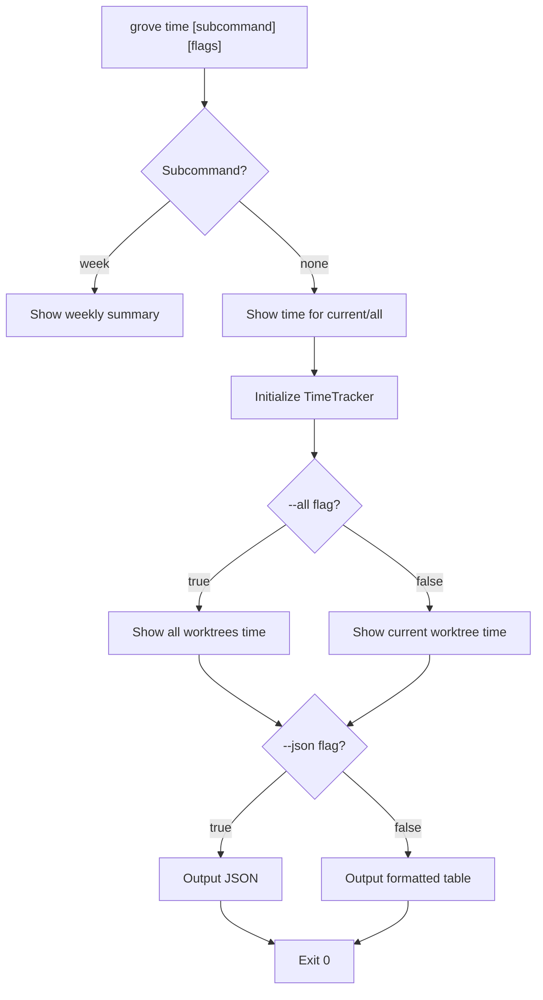

#### System Changes

| Change Type | Description | Condition |
|-------------|-------------|-----------|
| File (Read) | Reads `~/.config/grove/state/time.json` | Always |
| Memory | Loads all time entries | No streaming |

#### Operational Safety

**Data Loss Risk:** Low (read-only display command)

#### Flags and Options

| Flag | Type | Default | Effect |
|------|------|---------|--------|
| `--all` | Boolean | false | Show time for ALL worktrees |
| `--json` | Boolean | false | Output as JSON |
| `week` | Subcommand | N/A | Show weekly time summary |

---

### grove config

**Purpose:** Display current grove configuration.

**Dependencies:** `internal/config`

#### System Changes

| Change Type | Description | Condition |
|-------------|-------------|-----------|
| File (Read) | Reads `~/.config/grove/config.toml` | On command |
| File (Read) | Reads `./.grove/config.toml` | If project config exists |

#### Operational Safety

**Data Loss Risk:** None (read-only)

---

### grove version

**Purpose:** Print version information of the grove binary.

**Dependencies:** `internal/version`

#### System Changes

| Change Type | Description | Condition |
|-------------|-------------|-----------|
| Stdout | Writes version string | Always |

#### Operational Safety

**Data Loss Risk:** None (informational)

#### Flags and Options

| Flag | Short | Type | Default | Effect |
|------|-------|------|---------|--------|
| `--verbose` | `-v` | Boolean | false | Show full version with commit and build date |

---

## Internal Architecture

### Package Overview

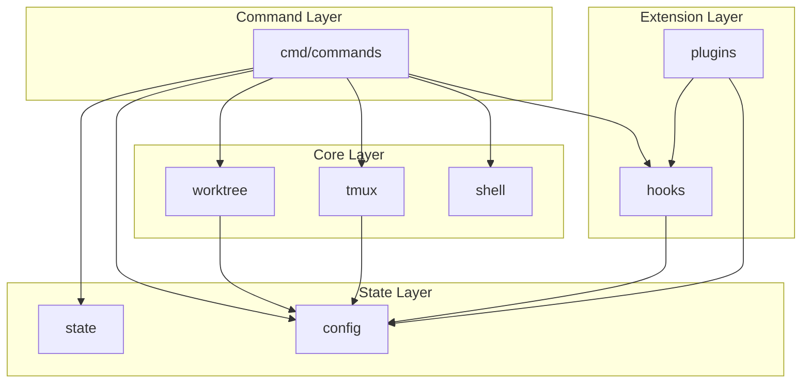

### worktree Package

**Location:** `internal/worktree/`

**Purpose:** Manages git worktree lifecycle operations.

**Key Types:**
- `Worktree` - Represents a worktree with metadata
- `Manager` - Main worktree management interface

**Key Functions:**
| Function | Behavior | System Changes |
|----------|----------|----------------|
| `NewManager()` | Detects repo root, initializes manager | None |
| `Create()` | Creates worktree with new branch | Creates directory, git metadata |
| `List()` | Lists all worktrees | None (read-only) |
| `Find()` | Searches by name | None (read-only) |
| `Remove()` | Removes worktree | Deletes directory, git metadata |
| `GetCurrent()` | Gets current worktree info | None (read-only) |
| `TmuxSessionName()` | Generates tmux session name | None |

### tmux Package

**Location:** `internal/tmux/`

**Purpose:** Manages tmux session lifecycle.

**Key Functions:**
| Function | Behavior | System Changes |
|----------|----------|----------------|
| `IsInsideTmux()` | Checks TMUX env var | None |
| `IsTmuxAvailable()` | Checks if tmux binary exists | None |
| `CreateSession()` | Creates detached session | Creates tmux session |
| `SwitchSession()` | Switches session | Changes tmux context |
| `KillSession()` | Kills tmux session | Destroys tmux session |
| `StoreLastSession()` | Stores session name | Writes file |
| `GetLastSession()` | Reads session name | None |

**State Storage:** `~/.config/grove/last_session`

### shell Package

**Location:** `internal/shell/`

**Purpose:** Generates shell integration code.

**Shell Integration Protocol:**
```bash
# Grove binary outputs: cd:/path/to/grove-cli-testing
# Shell wrapper detects GROVE_SHELL=1 and executes the cd
```

### state Package

**Location:** `internal/state/`

**Purpose:** Persists frozen worktree state.

**State File:** `~/.config/grove/state/frozen.json`

**Key Functions:**
| Function | Behavior | System Changes |
|----------|----------|----------------|
| `Freeze()` | Adds worktree to frozen map | Writes JSON file |
| `Resume()` | Removes from frozen map | Writes JSON file |
| `IsFrozen()` | Checks frozen status | None |
| `ListFrozen()` | Returns all frozen | None |

### hooks Package

**Location:** `internal/hooks/`

**Purpose:** Event system for plugins and extensions.

**Hook Events:**
| Event | When Triggered | Data Passed |
|-------|----------------|-------------|
| `pre-create` | Before creating worktree | Worktree name, Config |
| `post-create` | After creating worktree | Worktree name, Config |
| `pre-switch` | Before switching worktree | Worktree, PrevWorktree, Config |
| `post-switch` | After switching worktree | Worktree, PrevWorktree, Config |
| `pre-freeze` | Before freezing | Worktree, Config |
| `post-resume` | After resuming | Worktree, Config |
| `pre-remove` | Before removing | Worktree, Config |
| `post-remove` | After removing | Worktree, Config |

### config Package

**Location:** `internal/config/`

**Purpose:** Configuration management with defaults, loading, merging.

**Configuration Cascade:**
```
Defaults → Global (~/.config/grove/config.toml) → Project (./.grove/config.toml)
```

### plugins Package

**Location:** `internal/plugins/`

**Purpose:** Plugin system for extensibility.

**Plugin Interface:**
```go
type Plugin interface {
    Name() string
    Init(cfg *config.Config) error
    RegisterHooks(registry *hooks.Registry) error
    Enabled() bool
}
```

---

## Plugins

### Docker Plugin

**Location:** `plugins/docker/`

**Purpose:** Automate Docker container lifecycle management across worktrees.

**Hooks Registered:**
- `EventPostSwitch`: Auto-start containers
- `EventPreSwitch`: Auto-stop containers (optional)

**Configuration:**
```toml
[plugins.docker]
enabled = true
auto_start = true
auto_stop = false
```

**System Changes:**
| Change Type | Trigger |
|-------------|---------|
| Containers started | PostSwitch + auto_start enabled |
| Containers stopped | PreSwitch + auto_stop enabled |

**External Dependencies:** Docker daemon, `docker` or `docker-compose` CLI

### Time Plugin

**Location:** `plugins/time/`

**Purpose:** Passively record time spent in each worktree.

**Hooks Registered:**
- `EventPostSwitch`: Start/end sessions
- `EventPreFreeze`: End session
- `EventPostResume`: Start session

**State File:** `~/.config/grove/state/time.json`

**Data Format:**
```json
{
  "entries": [
    {
      "worktree": "feature-auth",
      "start_time": "2024-01-15T09:00:00Z",
      "end_time": "2024-01-15T11:30:00Z",
      "duration_seconds": 9000
    }
  ],
  "active_sessions": {
    "feature-auth": "2024-01-15T14:00:00Z"
  }
}
```

### Tracker Plugin

**Location:** `plugins/tracker/`

**Purpose:** Integrate with issue tracking systems (GitHub).

**Hooks Registered:** None (utility library)

**External Dependencies:** `gh` CLI (authenticated)

**Supported Operations:**
- `FetchIssue(number)` - Get issue metadata
- `FetchPR(number)` - Get PR metadata
- `ListIssues(opts)` - List issues with filters
- `ListPRs(opts)` - List PRs with filters

---

## Safety Summary

### Risk Levels by Command

| Command | Risk Level | Key Concern |
|---------|------------|-------------|
| `grove init` | None | Read-only output |
| `grove new` | Low | Creates new resources only |
| `grove rm` | **HIGH** | Deletes without confirmation |
| `grove ls` | None | Read-only |
| `grove here` | None | Read-only |
| `grove to` | Low | State changes reversible |
| `grove last` | Low | State changes reversible |
| `grove freeze` | Low | Idempotent state change |
| `grove resume` | Low | Reverse of freeze |
| `grove fetch` | Low | Creates new resources |
| `grove up` | Medium | Docker state changes |
| `grove down` | Low | Graceful shutdown |
| `grove logs` | None | Read-only |
| `grove restart` | Low | Container restart |
| `grove time` | None | Read-only display |
| `grove config` | None | Read-only |
| `grove version` | None | Informational |

### Critical Safety Notes

1. **`grove rm` is destructive** - No confirmation, deletes uncommitted changes
2. **Shell integration required** - Without `GROVE_SHELL=1`, directory changes don't work
3. **Docker auto_stop disabled by default** - To prevent port conflicts across worktrees
4. **Time tracking is passive** - Sessions auto-start/stop on worktree switches
5. **Atomic state writes** - Prevents corruption on crash

### State File Locations

| Purpose | Location |
|---------|----------|
| Last tmux session | `~/.config/grove/last_session` |
| Frozen worktrees | `~/.config/grove/state/frozen.json` |
| Time tracking | `~/.config/grove/state/time.json` |
| Global config | `~/.config/grove/config.toml` |
| Project config | `./.grove/config.toml` |

---

*Generated by Grove-CLI Tool Breakdown Analysis*
